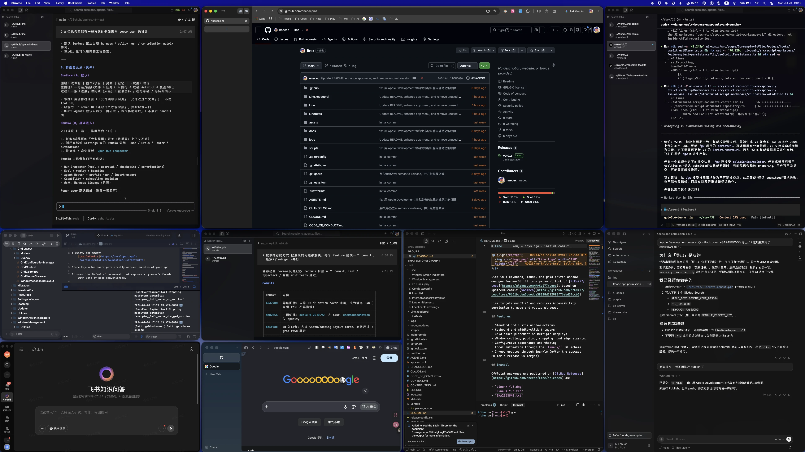

# Line

<p align="center">
  
</p>

<p align="center"><a href="README.md">English</a> · <strong>简体中文</strong></p>

Line 是一款 **macOS 原生**窗口管理器：**以网格为核心**、**多屏幕**、**高性能**、**开源**。它是 [MrKai77/Loop](https://github.com/MrKai77/Loop) 的个人维护分支，基于上游 commit [9661bcb](https://github.com/MrKai77/Loop/tree/9661bcbba0ba6dae38838d712998f76ebd57cc66)。

**一线到位。** · *Snap to the line.*

[](https://github.com/nnecec/Line/releases)
[](LICENSE)
[](https://github.com/nnecec/Line)

面向 macOS 26。

## 功能

- **网格布局**：完整、好用的网格摆放
- **多屏幕**布局与目标屏选择
- 高性能原生实现（AppKit / SwiftUI）
- 标准与自定义窗口操作、循环、边距、吸附与边缘收纳
- 可配置外观与主题
- 通过 `line://` URL scheme 做本地自动化
- 开源；应用内更新（Sparkle；对应版本的 appcast PR 合并后生效）

## 安装

官方包仅发布在 [GitHub Releases](https://github.com/nnecec/Line/releases)：

- `Line-X.Y.Z.dmg`
- `Line-X.Y.Z.zip`
- `SHA256SUMS.txt`

构建使用免费的 **Apple Development** 签名，以便辅助功能权限可以稳定保留。**不是** Developer ID 签名，**未**公证。首次打开：右键 → **打开**，然后在「系统设置 → 隐私与安全性 → **辅助功能**」中启用 Line。请只信任本仓库 Releases 中的文件。

应用内「检查更新」通过 Sparkle 读取 `main` 上的 [`appcast.xml`](appcast.xml)。每次发版后 appcast 会以 PR 形式合入；在 PR 合并前，Releases 可能已有新包，但应用仍可能显示「已是最新」。

### 截图



### 从源码构建

```bash
git clone https://github.com/nnecec/Line.git
cd Line
open Line.xcodeproj
```

### 维护者：发布版本

1. 将符合 Conventional Commits 的提交合入 `main`（`feat:`、`fix:` 等）。
2. 确认 tip 上 **CI** 与 **Lint** 通过。
3. 运行 **Actions → Publish**（可选 `dry_run`）。

详情见 [docs/RELEASES.md](docs/RELEASES.md)（英文）。

## 构建与测试

使用 Xcode 26.4 或兼容的 Xcode 26。本地开发用 `Line` scheme；CI / 发布用 `Line (GH ACTIONS)`。

```bash
make test-unit
make test-integration   # 需要辅助功能
make test-coverage
make build
make build-release
make help
```

## 架构与文档

- [Architecture](docs/ARCHITECTURE.md)（英文）
- [URL scheme](docs/URL_SCHEME.md)
- [Release process](docs/RELEASES.md)
- [Privacy](docs/PRIVACY.md)
- [Brand system](docs/BRAND.md)
- [Media kit / copy bank](assets/brand/MEDIA_KIT.md)
- [Channel checklist](assets/brand/CHANNEL_CHECKLIST.md)
- [Logo assets](logo/LOGO.md)

## 贡献与支持

提交 PR 前请阅读 [CONTRIBUTING.md](CONTRIBUTING.md)。缺陷与功能请用 GitHub issue 表单。安全问题见 [SECURITY.md](SECURITY.md)。支持说明见 [SUPPORT.md](SUPPORT.md)。

## 许可证与上游致谢

Line 以 [GNU GPL v3](LICENSE) 分发。原始设计与实现来自 [MrKai77/Loop](https://github.com/MrKai77/Loop)。
